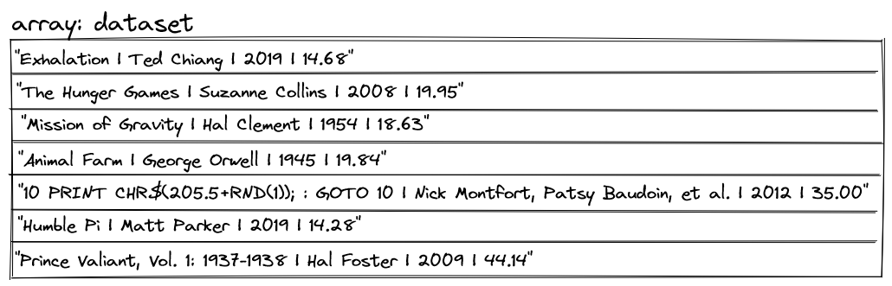
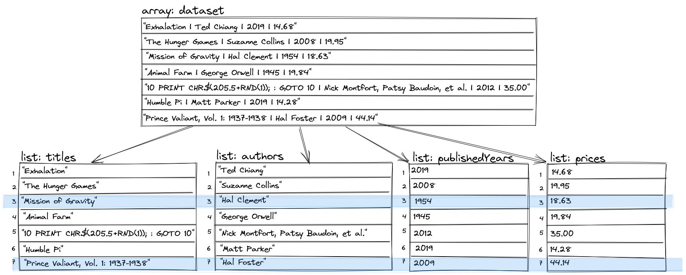

# Module One mid-module project

There are two options for the mid-module project. The two options are:
1. Implement the Book Search Application described below.
2. Create and implement your own application.

The provided Book Search application is guided with clear requirements describing exactly what work needs to be done.
However, since the application and the instructions were created by Tech Elevator it is a part of the
Tech Elevator curriculum and therefore the project and the source code can not be hosted publicly. 

If you decide to create your own application, you are free to host it and the source code publicly and include it in your software portfolio.
The following are the minimum requirements your application must include:
* At least 4 distinct pieces of data
  * Example 1: player, enemies, items, equipment   
  * Example 2: product, customer, order, cart
  * Example 3: song name, artist, release date, genre 
* At least 4 data structures
  * Arrays, Lists, Maps, Stacks, Queues, Sets
* At least 10 methods (or algorithms) that manipulate the data structures
  * Examples:
    * looping over elements
    * searching for element(s) based on criteria(s)
    * sorting elements
    * filtering elements
* A way for a user to interact with the application
* A clear purpose, function, or utility 

## Book Search Application

This application allows users to search book data by title, author, year published, and price. Users can search for a particular title or author, a range of prices, or a year of publication. The application displays the search results on the console.

The [Requirements](#requirements) section later in this document describes the specific searches and format of the results.

## Starting code

Begin by opening the Module One mid-module project in IntelliJ and reviewing the starting code.

The starting code provides a menu-based user interface that handles user input, displays unfiltered data, and calls to methods in the application.

The Module One mid-module project is a small application with only two classes:

* `Dataset.java` - The data used within the application
* `App.java` - The *main* class of the application

### `Dataset.java`

The data is a hardcoded array of strings in the `Dataset` class. This class has a single `load()` method to return the hardcoded `String` array. **The code in this class is complete, and you shouldn't modify it.**

### `App.java`

The `App` class contains two primary methods:

* `loadData()` - Loads the `String` array by calling `Dataset.load()`. Later, you'll transform the single array of strings into collections of different data types. The [Requirements](#requirements) section describes this in greater detail.
* `run()` - The loop responsible for displaying the application menus and search results.

The `main()` method of the `App` class calls these methods when the application starts.

Immediately following these two methods, you'll see several "stubbed-out" methods beginning with `filter...()`. You must implement the logic for these methods as described in the [Requirements](#requirements) section.

Following the `filter...()` methods are some additional methods whose names begin with `print...()`, `display...()`, and `prompt...()`. These methods comprise the application UI. You won't need to change this code, but feel free to browse it. **These methods are complete, and you shouldn't modify them.**

## Requirements

You must complete several requirements for data transformation and searching. The code contains comments beginning with `Requirement:` to indicate where you must add code to satisfy each requirement.

### Data transformation



A closer examination of the dataset reveals that each string in the array contains four fields: title, author, publication year, and price. The dataset uses a pipe character (`|`) to separate the fields.

While it's possible to search through each `String` as a whole, there are potential problems. For instance, assuming a case-insensitive search, looking for authors named "hal" would find three books:

* Two for authors "*Hal* Clement" and "*Hal* Foster"
* One for the title "Ex*hal*ation"

A better approach is to separate the fields for each `String` into four `ArrayList`s, one for each of the four fields: `titles`, `authors`, `publishedYears`, and `prices`, then search the appropriate list. So, if the user searches for authors named "hal", you'd search the `authors` list to ensure that you don't return any unwanted matches from other fields.



To relate the data between lists, you'll use the element index to link them. For example, if "hal" matches in the `authors` list at indexes 3 and 7, you can use the same index to relate the titles, years of publication, and prices in the other lists. Continuing with the "hal" example, index 3 in the `titles` list is "Mission of Gravity" (by Hal Clement), and index 7 is "Prince Valiant, Vol. 1: 1937-1938" (by Hal Foster).

>Note: these indexes are for demonstration purposes. The actual indexes in your application may be different.

**Requirement: 1**

Add code where indicated to populate the instance variables `titles`, `authors`, `publishedYears`, and `prices`. To do this, split each string in the `dataset` array adding the individual fields to their respective list. *Make sure to keep the values in sync across the lists, as shown in the diagram.*

>Recommendation: Use the provided `FIELD_DELIMITER` constant when splitting.

To verify you completed this requirement correctly, run the application and select the main menu option "Display data and subsets" to print the primary dataset and list the subset collections you created.

### Searching

Any search has three steps: getting the values to search for, finding the matches, and displaying the results. The provided code already handles the first step to get the value to search for from the user. You must add code to find the matches and display the results.

Your search must allow for partial matches and be case-insensitive for strings. In this application, a search happens on a single list at a time—`titles`, `authors`, `publishedYears`, or `prices`—depending on the method called. The search returns a list of the indexes that match the search value.

>Note: Any search may yield multiple matches, so a list of the found indexes is necessary even if only one match exists.

To verify you completed this requirement correctly, run the application and select the main menu option "Search books" to perform some searches.

**Requirement: 2**

To display the search results, add the following method where indicated in the code:

```java
private void displaySearchResults(List<Integer> indexes)
```

The method displays the complete search result information for each index in the list of indexes using the following format:

`<title>: <author>: <publication year>: $<price>`

For example, the output for the authors found previously follows:

```
Mission of Gravity: Hal Clement: 1954: $18.63
Prince Valiant, Vol. 1: 1937-1938: Hal Foster: 2009: $44.14
```

>Note: Your search results may appear in any order.

**Requirement: 3a**

Complete the `filterByTitle()` method to find matching titles:

```java
filterByTitle(String filterTitle)
```

>Note: The run-loop has code that prompts for the `filterTitle`.

**Requirement: 3b**

Replace `displayTitlesList(titles)` with calls to `filterByTitle()` and `displaySearchResults()` methods to search for `filterTitle` and display the results.

**Requirement: 4a**

Complete the `filterByAuthor()` method to find matching authors:

```java
filterByAuthor(String filterAuthor)
```

>Note: The run-loop has code that prompts for the `filterAuthor`.

**Requirement: 4b**

Replace `displayAuthorsList(authors)` with calls to the `filterByAuthor()` and `displaySearchResults()` methods to search for `filterAuthor` and display the results.

**Requirement: 5a**

Complete the `filterByPublishedYear()` method to find matching published years:

```java
filterByPublishedYear(int filterYear)
```

>Note: The run-loop has code that prompts for the `filterYear`.

**Requirement: 5b**

Replace `displayPublishedYearsList(publishedYears)` with calls to the `filterByPublishedYear()` and `displaySearchResults()` methods to search for `filterYear` and display the results.

**Requirement: 6a**

Complete the `filterByPublishedYearRange()` method to find books that are between two published years:

```java
filterByPublishedYearRange(int filterFromYear, int filterToYear)
```

>Note: The run-loop has code that prompts for the `filterFromYear` and `filterToYear`.

**Requirement: 6b**

Replace `displayPublishedYearsList(publishedYears)` with calls to the `filterByPublishedYearRange()` and `displaySearchResults()` methods to search `filterFromYear` to `filterToYear` and display the results.

**Requirement: 7a**

Add this method to find the index of the book or books with the most recent published year:

```java
private List<Integer> findMostRecentBooks()
```

>Hint: The method first needs to determine the latest year of publication within the published years list before finding the most recent books.

**Requirement: 7b**

Replace `displayPublishedYearsList(publishedYears)` with calls to the `findMostRecentBooks()` and `displaySearchResults()` methods to search and display the results.

**Requirement: 8a**

Complete the `filterByPrice()` method to find books less than or equal to the searched price:

```java
filterByPrice(double filterPrice)
```

>Note: The run-loop has code that prompts for the `filterPrice`.

**Requirement: 8b**

Replace `displayPricesList(prices)` with calls to the `filterByPrice()` and `displaySearchResults()` methods to search for `filterPrice` and display the results.

**Requirement: 9a**

Complete the `filterByPriceRange()` method to find books between two prices:

```java
filterByPriceRange(double filterFromPrice, double filterToPrice)
```

>Note: The run-loop has code that prompts for the `filterFromPrice` and `filterToPrice`.

**Requirement: 9b**

Replace `displayPricesList(prices)` with calls to the `filterByPriceRange()` and `displaySearchResults()` methods to search `filterFromPrice` to `filterToPrice` and display the results.

**Requirement: 10a**

Add the method to find the index of the book or books with the lowest price:

```java
private List<Integer> findLeastExpensiveBooks()
```

>Hint: The method must determine the lowest price within the list before finding the least expensive books.

**Requirement: 10b**

Replace `displayPricesList(prices)` with calls to the `findLeastExpensiveBooks()` and `displaySearchResults()` methods to search and display the results.

## Challenges

The following challenges are optional, and *you must only attempt them after completing all the previous requirements*.

**Challenge: 1**

Add a second parameter `int primaryField` to `displaySearchResults()`. The primary field is the field getting searched by. Display the primary field as the first element of the output line, then display the rest of the fields.

| `primaryField` | output |
|---|---|
| `0` | title: author: publication year: price |
| `1` | author: title: publication year: price |
| `2` | publication year: title: author: price |
| `3` | price: title: author: publication year |

>Recommendation: Use the provided constants `TITLE_FIELD`, `AUTHOR_FIELD`, `PUBLISHED_YEAR_FIELD`, and `PRICE_FIELD` to help you with this challenge.

**Challenge: 2**

Sort the output of the challenge `displaySearchResults()` method by the primary field.

Add a *helper* method `sortSearchResults` to sort the list of indexes and call this method before the loop inside `displaySearchResults()`.

```java
private void sortSearchResults(List<Integer> indexes, int primaryField)
```
> Recommendation: There are many algorithms (or ways) to sort data. One of the most straightforward (but not the fastest) is the **bubble sort**, which gets its name from appearing to *bubble* data to the top.
>
> In a bubble sort, you start at the beginning of the list and compare the first two values. If the first sorts after the second, you swap them. Then compare the second and third, again swapping them if the second sorts after the third. Continue to repeat this until you get to the end of the list. Now the value that sorts last is at the end of the list. Since this only moves one value, you must go back to the beginning of the list and repeat the process until you pass through the list without swapping a value. To make things more efficient, you can check one less item each time through the list since the last item is always where it belongs.
>
>The following animated image walks through the bubble sort process using a list of numbers.

>
> There is also a complete, text-based, static image of the preceding animated image in the `img` folder. Use this to view the walk-through at your own pace.